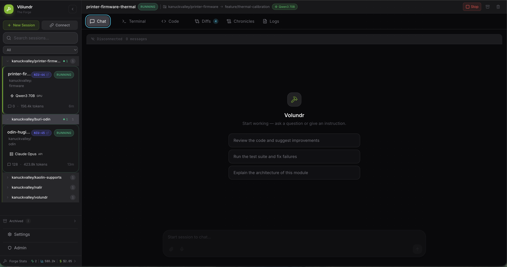

# Volundr

[](https://github.com/niuulabs/volundr/actions/workflows/ci.yaml)
[](https://github.com/niuulabs/volundr/actions/workflows/release.yaml)
[](https://github.com/niuulabs/volundr/actions/workflows/secrets.yaml)
[](https://scorecard.dev/viewer/?uri=github.com/niuulabs/volundr)
[](https://codecov.io/gh/niuulabs/volundr)
[](LICENSE)

Self-hosted remote development platform on Kubernetes or Docker. Manages session lifecycle, workspace provisioning, git workflows, secret injection, and multi-tenant access control through a REST API and web UI.

<p align="center">
  
</p>

## Components

```
┌──────────────────┐     ┌────────────────────┐
│   Hlidskjalf UI  │────▶│   Volundr API      │
│   (React/Vite)   │     │   (FastAPI)         │
└──────────────────┘     └────────┬───────────┘
                                  │
                    ┌─────────────┼──────────────┐
                    ▼             ▼              ▼
              ┌──────────┐ ┌──────────┐  ┌────────────┐
              │  Skuld   │ │  Code    │  │  Terminal   │
              │ (broker) │ │  Server  │  │  (ttyd)     │
              └────┬─────┘ └────┬─────┘  └─────┬──────┘
                   └────────────┴───────────────┘
                                │
                     Shared Workspace PVC
```

- **Volundr API** — session CRUD, workspace provisioning, git integration, secret management, tenant hierarchy, event pipeline. FastAPI on asyncpg (raw SQL, no ORM).
- **Skuld** — WebSocket broker that connects the UI to AI coding agents inside session pods. Supports SDK and subprocess transport modes.
- **Hlidskjalf** — React web UI for session management, chronicles, diffs, terminal access, and admin. CSS Modules with design tokens.

Each session launches a pod group on Kubernetes. Chat traffic flows directly from the UI through Skuld — Volundr is not in the data path.

## Features

- **Sessions** — create, start, stop, archive coding sessions with model selection and preset configuration
- **Workspaces** — per-session PVC provisioning with user home volumes and storage quotas
- **Templates** — config-driven workspace blueprints with repos, setup scripts, and runtime settings
- **Presets** — portable runtime configs (model, MCP servers, resources, env vars) stored in the database
- **Profiles** — read-only workload configurations loaded from YAML or CRDs
- **Chronicles** — session history snapshots with timelines, file diffs, commit summaries, and reforge chains
- **Git workflows** — branch creation, PR management, CI status checks, merge confidence scoring across GitHub and GitLab
- **Saved prompts** — reusable prompts scoped globally or per-project
- **Secret injection** — CSI-based secret mounting via Infisical, OpenBao/Vault, or in-memory backends
- **Credential management** — pluggable credential stores (Vault, Infisical, memory) for API keys, OAuth tokens, SSH keys
- **Multi-tenancy** — hierarchical tenant tree with roles (admin, developer, viewer) and quota enforcement
- **Identity** — IDP-agnostic OIDC authentication with JIT user provisioning via Envoy headers
- **Authorization** — pluggable policy engine (Cerbos, simple role-based, or allow-all)
- **Issue tracking** — Jira and Linear integration with repo-to-project mappings and dynamic adapter loading
- **Event pipeline** — session events dispatched to PostgreSQL, RabbitMQ, and/or OpenTelemetry sinks
- **MCP servers** — configurable Model Context Protocol servers injected into sessions
- **SSE streaming** — real-time session state and stats updates

## Quick start

```bash
# Install dependencies
uv sync --all-extras --dev

# Copy and edit config
cp config.yaml.example config.yaml

# Start the API server
uv run volundr

# Or with auto-reload
uv run uvicorn volundr.main:app --reload --port 8080
```

The API serves at `http://localhost:8080`. Interactive docs at `/docs`.

## Configuration

Config loads from YAML with environment variable overrides:

```
./config.yaml              # first priority
/etc/volundr/config.yaml   # second priority
```

Environment variables use double underscores for nesting:

```bash
DATABASE__HOST=postgres.local
DATABASE__PASSWORD=secret
GIT__GITHUB__TOKEN=ghp_xxxx
EVENT_PIPELINE__OTEL__ENABLED=true
```

See the [configuration reference](https://niuulabs.github.io/volundr/configuration/) for all options.

## Testing

```bash
# Backend (85% coverage enforced)
uv run pytest tests/ -v

# Web UI (85% coverage enforced)
cd web && npm run test:coverage

# Lint
uv run ruff check src/ tests/
```

## Deployment

```bash
helm install volundr ./charts/volundr -n volundr \
  --set database.external.host=postgres.svc.cluster.local \
  --set ingress.enabled=true \
  --set ingress.hosts[0].host=volundr.example.com
```

See the [deployment guide](https://niuulabs.github.io/volundr/deployment/) for Helm values, migrations, and production setup.

## Tech stack

| Layer | Technology |
|-------|-----------|
| API | FastAPI, Uvicorn, Pydantic |
| Database | PostgreSQL via asyncpg (raw SQL) |
| Web UI | React, Vite, CSS Modules |
| Broker | FastAPI WebSockets |
| Orchestration | Kubernetes, Helm |
| Auth | OIDC/OAuth2, Envoy, Cerbos |
| Secrets | OpenBao/Vault, Infisical, CSI driver |
| Observability | OpenTelemetry (traces + metrics) |
| Events | RabbitMQ (optional), SSE |
| Git | GitHub API, GitLab API |

## Optional dependencies

```bash
uv sync --extra rabbitmq   # RabbitMQ event sink
uv sync --extra litellm    # LiteLLM model routing
uv sync --extra k8s        # Kubernetes client
uv sync --extra otel       # OpenTelemetry export
```

## Documentation

Full documentation at [niuulabs.github.io/volundr](https://niuulabs.github.io/volundr/).

## License

Apache 2.0 — see [LICENSE](LICENSE).
