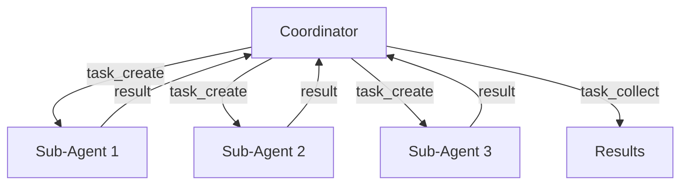

# Cascade & Parallel Execution

Cascade enables Ravn to coordinate multiple sub-agents working in parallel.
A coordinator agent breaks work into sub-tasks, dispatches them, monitors
progress, and collects results.

## Architecture



The coordinator runs the full agent loop with cascade tools available.
Sub-agents run their own drive loops with a restricted tool set (typically
the `worker` profile — core tools only).

## Execution Modes

### Mode 1: Local Parallel

Sub-agents spawn as local subprocesses on the same machine. Best for
single-machine workloads.

### Mode 2: Networked Delegation

Sub-tasks are sent to peer Ravn instances via the mesh transport. Requires
`mesh.enabled` and at least one reachable peer.

### Mode 3: Ephemeral Spawn

Sub-agents are spawned in Kubernetes pods or Docker containers for isolated
execution. Requires spawn adapter configuration.

## Cascade Tools

| Tool | Permission | Description |
|------|-----------|-------------|
| `task_create` | `cascade:write` | Create a sub-task with prompt, persona, and output mode. |
| `task_collect` | `cascade:read` | Wait for and collect results from sub-tasks. Blocks until timeout. |
| `task_status` | `cascade:read` | Check status of a specific sub-task by ID. |
| `task_list` | `cascade:read` | List all active and completed sub-tasks. |
| `task_stop` | `cascade:write` | Cancel a running sub-task. |

## Tool Profiles

The coordinator and workers typically use different tool sets:

```yaml
tools:
  profiles:
    coordinator:
      include_groups: [core, extended, cascade]
    worker:
      include_groups: [core]
```

This prevents sub-agents from spawning their own sub-agents (no cascade
tools in the worker profile).

## Watchdog

The cascade watchdog monitors sub-agent health:

- **Stuck detection**: if a sub-agent makes no progress for
  `stuck_timeout_seconds` (default: 60s), it's marked as stuck
- **Loop detection**: if a sub-agent makes `loop_detection_threshold`
  (default: 3) identical consecutive tool calls, it's marked as stuck

**Stuck strategies:**

| Strategy | Behavior |
|----------|----------|
| `retry` | Kill and restart the sub-agent with same prompt. |
| `replan` | Ask the coordinator to reformulate the task. |
| `escalate` | Surface the stuck task to the user. |
| `abort` | Cancel the sub-task and report failure. |

## Configuration

```yaml
cascade:
  enabled: true
  spawn_timeout_s: 30.0
  collect_timeout_s: 300.0
  collect_poll_interval_s: 2.0
  mesh_delegation_timeout_s: 30.0
  stuck_timeout_seconds: 60
  loop_detection_threshold: 3
  on_stuck: replan
  max_retries: 2
```

See the [Configuration Reference](../configuration/reference.md#cascade) for all fields.

## Example: Parallel Task Dispatch

```
Coordinator prompt: "Run tests for all three microservices in parallel"

→ task_create("Run tests for auth-service", persona="coding-agent")
→ task_create("Run tests for api-gateway", persona="coding-agent")
→ task_create("Run tests for billing-service", persona="coding-agent")
→ task_collect(timeout=300)

Results:
  - auth-service: 47/47 tests passed
  - api-gateway: 23/24 tests passed (1 failure in rate_limit_test)
  - billing-service: 31/31 tests passed
```

Related: [NIU-435](https://linear.app/niuulabs/issue/NIU-435), [NIU-510](https://linear.app/niuulabs/issue/NIU-510)
