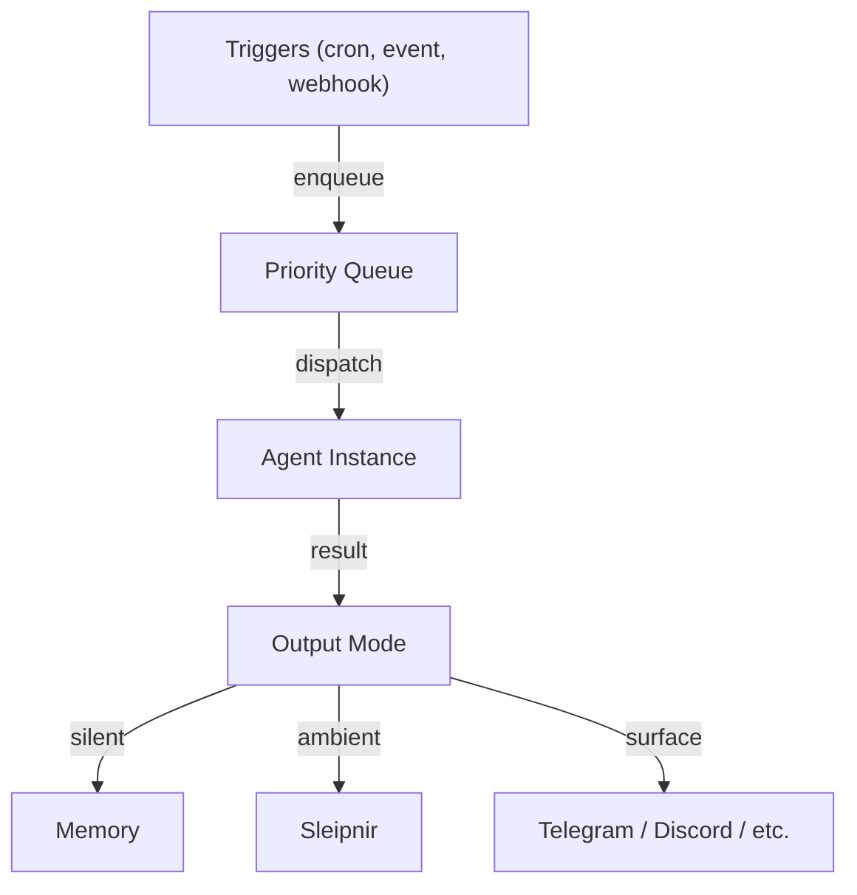

# Drive Loop & Triggers

The drive loop (initiative engine) enables Ravn to act autonomously — executing
tasks on schedules, responding to events, and managing a priority queue of work.

## Architecture



The drive loop runs inside `ravn daemon`. It:

1. Evaluates trigger conditions on a configurable tick interval
2. Enqueues matching tasks into a priority queue
3. Dispatches tasks to agent instances (up to `max_concurrent_tasks`)
4. Routes results based on the task's output mode

## Trigger Types

### Cron Triggers

Time-based scheduling using cron expressions:

```yaml
initiative:
  trigger_adapters:
    - adapter: "ravn.adapters.triggers.cron.CronTrigger"
      schedule: "0 9 * * 1-5"  # Weekdays at 9 AM
      prompt: "Check for open PRs that need review"
      persona: coding-agent
      output_mode: surface
```

Agents can also create cron jobs at runtime using the `cron_create` tool.

### Event Triggers

React to Sleipnir events:

```yaml
initiative:
  trigger_adapters:
    - adapter: "ravn.adapters.triggers.sleipnir.SleipnirEventTrigger"
      event_type: "deployment.completed"
      prompt: "Verify the deployment succeeded and run smoke tests"
```

### Webhook / Custom Triggers

Custom trigger adapters can respond to any external signal:

```yaml
initiative:
  trigger_adapters:
    - adapter: "mypackage.triggers.WebhookTrigger"
      port: 8888
      path: "/trigger"
```

## Output Modes

Each task has an output mode that controls where results go:

| Mode | Behavior |
|------|----------|
| `silent` | Agent runs, results stored in memory. Nothing external. |
| `ambient` | Results published to Sleipnir for the attention model. |
| `surface` | Results delivered directly via configured channel (Telegram, etc.). |

## Task Priority

Tasks are dispatched from a priority queue (lower number = higher priority).
Tasks can have deadlines — expired tasks are discarded without execution.

## Queue Persistence

The task queue is journaled to disk at `queue_journal_path`. On `ravn daemon --resume`,
unfinished tasks are restored from the journal.

```yaml
initiative:
  queue_journal_path: "~/.ravn/daemon/queue.json"
```

## Configuration

```yaml
initiative:
  enabled: true
  max_concurrent_tasks: 3
  task_queue_max: 50
  queue_journal_path: "~/.ravn/daemon/queue.json"
  default_output_mode: silent
  default_persona: ""
  heartbeat_interval_seconds: 60
  cron_tick_seconds: 30.0
```

See the [Configuration Reference](../configuration/reference.md#initiative) for all fields.

Related: [NIU-539](https://linear.app/niuulabs/issue/NIU-539)
