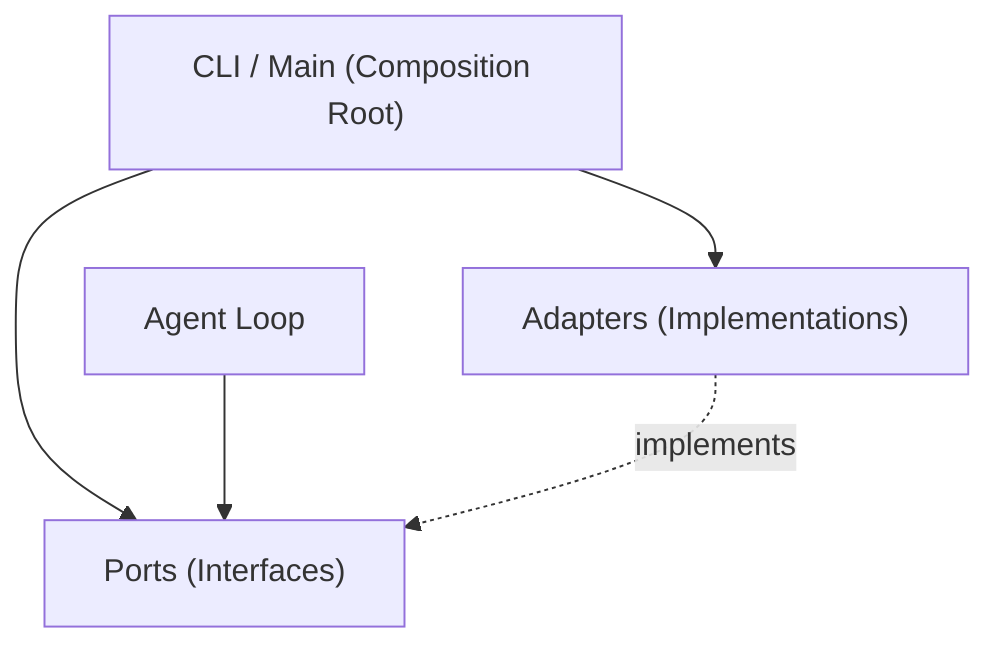
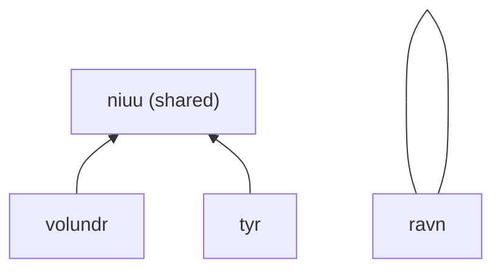

# Architecture

Ravn follows hexagonal architecture (ports and adapters) with strict module
boundaries. This guide covers the design principles for contributors.

## Hexagonal Architecture



| Layer | Directory | Responsibility |
|-------|-----------|---------------|
| **Ports** | `src/ravn/ports/` | Abstract base classes defining interfaces. |
| **Adapters** | `src/ravn/adapters/` | Concrete implementations of ports. |
| **Domain** | `src/ravn/domain/` | Models, enums, exceptions — no dependencies. |
| **Agent** | `src/ravn/agent.py` | Core agent loop — imports ports only. |
| **CLI** | `src/ravn/cli/` | Composition root — wires adapters to ports. |

### Rules

- **Agent and domain** import from `ports/` only, never from `adapters/`
- **Adapters** implement port interfaces
- **CLI/main** is the composition root — it imports everything and wires it together
- **No adapter may depend on another adapter** — use ports for cross-cutting

## Port Inventory

| Port | File | Methods |
|------|------|---------|
| `LLMPort` | `llm.py` | `generate()`, `stream()` |
| `MemoryPort` | `memory.py` | `query()`, `prefetch()`, `save_episode()` |
| `ToolPort` | `tool.py` | `name`, `description`, `input_schema`, `execute()` |
| `PermissionPort` | `permission.py` | `check()`, `evaluate()` |
| `CheckpointPort` | `checkpoint.py` | `save()`, `load()`, `delete()` |
| `ChannelPort` | `channel.py` | `emit()` |
| `MeshPort` | `mesh.py` | `publish()`, `subscribe()`, `send()` |
| `DiscoveryPort` | `discovery.py` | `announce()`, `scan()`, `watch()` |
| `EmbeddingPort` | `embedding.py` | `embed()`, `embed_batch()` |
| `SkillPort` | `skill.py` | `list()`, `get()`, `save()` |
| `EventPublisherPort` | `event_publisher.py` | `publish()` |
| `MimirPort` | `mimir.py` | `query()`, `ingest()`, `write()`, `lint()` |
| `OutcomePort` | `outcome.py` | `record()`, `query()` |
| `BrowserPort` | `browser.py` | `navigate()`, `screenshot()`, `click()` |

## Dynamic Adapter Pattern

New adapters use dynamic import + kwargs for zero-code extensibility:

```yaml
llm:
  provider:
    adapter: "ravn.adapters.llm.anthropic.AnthropicAdapter"
    kwargs:
      timeout: 60
```

The composition root resolves this at startup:

```python
def _import_class(dotted_path: str) -> type:
    module_path, class_name = dotted_path.rsplit(".", 1)
    module = importlib.import_module(module_path)
    return getattr(module, class_name)

cls = _import_class(config["adapter"])
kwargs = {k: v for k, v in config.items() if k != "adapter"}
instance = cls(**kwargs)
```

Adding a new adapter = write the class + update YAML. No code changes
elsewhere.

## Module Boundaries



| Rule | Description |
|------|-------------|
| `tyr` cannot import from `volundr` | Strictly forbidden. |
| `volundr` cannot import from `tyr` | Strictly forbidden. |
| Both import from `niuu` | Shared code (models, ports, adapters). |
| `niuu` imports from neither | No reverse dependencies. |
| `ravn` is independent | Separate agent framework. |

Extract to `niuu` when both Volundr and Tyr need the same interface.

## Agent Loop

The core agent loop (`agent.py`) follows this cycle:

1. Receive user message
2. Prefetch relevant memory
3. Build prompt (system + context + history + message)
4. Call LLM (streaming)
5. Extract tool calls from response
6. For each tool call:
   - Run pre-tool hooks
   - Check permissions
   - Execute tool
   - Run post-tool hooks
7. Feed results back to LLM
8. Repeat until `stop_reason != tool_use`
9. Record episode to memory
10. Return turn result

The loop respects:
- Iteration budget (max tool calls per session)
- Context compression (when context window fills)
- Checkpoint triggers (periodic saves)
- Permission checks (per-tool authorization)

## Directory Structure

```
src/ravn/
├── adapters/
│   ├── browser/          # Browser automation
│   ├── channels/         # Communication (Telegram, Discord, etc.)
│   ├── checkpoint/       # Persistence (disk, postgres)
│   ├── discovery/        # Peer detection (mDNS, K8s, Sleipnir)
│   ├── embedding/        # Vector embeddings
│   ├── events/           # Event publishing (RabbitMQ)
│   ├── llm/              # LLM providers (Anthropic, OpenAI, Bifrost)
│   ├── mcp/              # Model Context Protocol
│   ├── memory/           # Episodic memory (SQLite, Postgres, Búri)
│   ├── mesh/             # Peer-to-peer transport (nng, Sleipnir)
│   ├── mimir/            # Knowledge base (HTTP, Markdown, composite)
│   ├── permission/       # Authorization enforcement
│   ├── personas/         # Persona loader
│   ├── skill/            # Skill storage (file, SQLite)
│   ├── spawn/            # Process spawning (subprocess, K8s)
│   ├── tools/            # Built-in tool implementations
│   └── triggers/         # Drive loop triggers (cron, events)
├── cascade/              # Task delegation watchdog
├── cli/                  # CLI commands (Typer)
├── context/              # Compression and evolution
├── domain/               # Models, enums, exceptions
├── ports/                # Interface definitions (ABCs)
├── skills/               # Built-in skill Markdown files
├── tui/                  # Terminal UI (Textual)
├── agent.py              # Core agent loop
├── config.py             # Configuration system
└── __main__.py           # Entry point
```
