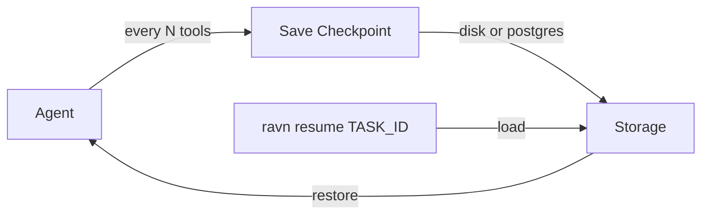

# Checkpointing & Resume

Ravn's checkpoint system enables crash recovery and task resumption. It
periodically saves agent state so that interrupted tasks can be resumed
from the last checkpoint.

## How It Works



After every `checkpoint_every_n_tools` (default: 10) tool calls, the agent
saves its state. On crash or interruption, `ravn resume` restores the
session from the latest checkpoint.

## Checkpoint Contents

Each checkpoint captures:

| Field | Description |
|-------|-------------|
| Session messages | Full conversation history |
| Tool call count | Number of tools executed |
| Current turn state | In-progress turn data |
| Completion status | Whether the task is finished |
| Todos | Current task list |

## Crash-Recovery Checkpoints

Crash-recovery checkpoints are per-task and overwritten on each save:

| Operation | Description |
|-----------|-------------|
| `save(checkpoint)` | Persist after each trigger. |
| `load(task_id)` | Load on resume. |
| `delete(task_id)` | Clean up after completion. |
| `list_task_ids()` | List available tasks. |

## Named Snapshots

Named snapshots allow multiple save points per task:

| Operation | Description |
|-----------|-------------|
| `save_snapshot(checkpoint)` | Save as `ckpt_{task_id}_{seq}`. |
| `load_snapshot(checkpoint_id)` | Load specific snapshot. |
| `list_for_task(task_id)` | All snapshots for a task. |
| `delete_snapshot(checkpoint_id)` | Remove a snapshot. |

## Auto-Checkpoint Triggers

Checkpoints are automatically saved:

| Trigger | Config | Default |
|---------|--------|---------|
| Every N tool calls | `checkpoint_every_n_tools` | 10 |
| Before destructive operations | `auto_before_destructive` | `true` |
| At budget milestones | `budget_milestone_fractions` | `[0.5, 0.75, 0.9]` |

"Destructive operations" include `rm`, `git reset`, `drop table`, etc.

Budget milestones create snapshots at 50%, 75%, and 90% of the iteration
budget, providing restore points if the agent goes off track.

## Storage Backends

| Backend | Description |
|---------|-------------|
| `local` (default) | Disk-based, stored in `~/.ravn/checkpoints/`. |
| `postgres` | PostgreSQL-based, for shared/HA deployments. |

## Resume Workflow

### Resume Latest

```bash
# Resume from the latest crash-recovery checkpoint
ravn resume task_abc123
```

### Resume Specific Snapshot

```bash
# List available snapshots
ravn resume task_abc123 --list

# Resume from a specific snapshot
ravn resume task_abc123 -c ckpt_task_abc123_3
```

### Drive Loop Resume

When running as a daemon, `--resume` restores unfinished tasks from the
queue journal:

```bash
ravn daemon --resume
```

This loads the persisted task queue and resumes any interrupted tasks.

## Configuration

```yaml
checkpoint:
  enabled: true
  backend: local
  dir: "~/.ravn/checkpoints"
  checkpoint_every_n_tools: 10
  max_checkpoints_per_task: 20
  auto_before_destructive: true
  budget_milestone_fractions: [0.5, 0.75, 0.9]
```

Related: [NIU-504](https://linear.app/niuulabs/issue/NIU-504), [NIU-537](https://linear.app/niuulabs/issue/NIU-537)
