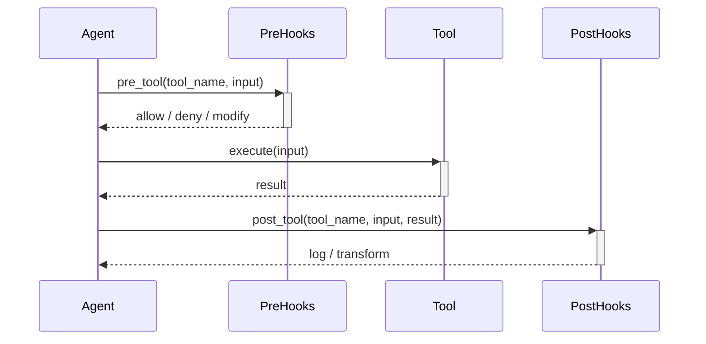

# Hooks

Hooks allow custom code to run before or after tool executions. They are
useful for auditing, metrics, sanitization, and custom validation.

## Hook Lifecycle



1. **Pre-tool hooks** run before tool execution. They can:
   - Allow the call to proceed
   - Deny the call (with reason)
   - Modify the input

2. **Post-tool hooks** run after tool execution. They can:
   - Log the result
   - Transform the output
   - Trigger side effects

## Configuration

```yaml
hooks:
  pre_tool:
    - adapter: "mypackage.hooks.AuditHook"
      kwargs:
        log_path: "/var/log/ravn/audit.log"
      events: ["pre_tool"]

    - adapter: "mypackage.hooks.SanitizeHook"
      kwargs:
        patterns: ["password", "secret", "token"]
      events: ["pre_tool"]

  post_tool:
    - adapter: "mypackage.hooks.MetricsHook"
      kwargs:
        statsd_host: "localhost"
        statsd_port: 8125
      events: ["post_tool"]
```

### Hook Config Fields

| Field | Type | Description |
|-------|------|-------------|
| `adapter` | str | Fully-qualified class path for the hook. |
| `kwargs` | dict | Constructor arguments. |
| `secret_kwargs_env` | dict | Env var names for secret constructor args. |
| `events` | list[str] | Event types to subscribe to: `pre_tool`, `post_tool`. |

## Built-in Hook Use Cases

### Permission Hook

The permission system itself operates as a pre-tool hook, checking every
tool call against the active permission mode and rules before execution.

### Approval Hook

When `permission.mode` is `prompt`, the approval hook intercepts tool calls,
prompts the user, and caches approved patterns.

### Budget Hook

Tracks iteration budget usage and injects "near limit" warnings when
the agent approaches the configured threshold.

## Custom Hook Development

Implement a hook by creating a class with the appropriate method signatures:

```python
class MyHook:
    def __init__(self, log_path: str):
        self.log_path = log_path

    async def pre_tool(
        self, tool_name: str, tool_input: dict
    ) -> dict | None:
        """Return None to allow, or a dict with 'deny' key to block."""
        # Log the call
        with open(self.log_path, "a") as f:
            f.write(f"{tool_name}: {tool_input}\n")
        return None  # allow

    async def post_tool(
        self, tool_name: str, tool_input: dict, result: str
    ) -> str | None:
        """Return None to pass through, or a string to replace result."""
        return None  # pass through
```

Register in config:

```yaml
hooks:
  pre_tool:
    - adapter: "mypackage.hooks.MyHook"
      kwargs:
        log_path: "/var/log/ravn/my_hook.log"
      events: ["pre_tool"]
  post_tool:
    - adapter: "mypackage.hooks.MyHook"
      kwargs:
        log_path: "/var/log/ravn/my_hook.log"
      events: ["post_tool"]
```
