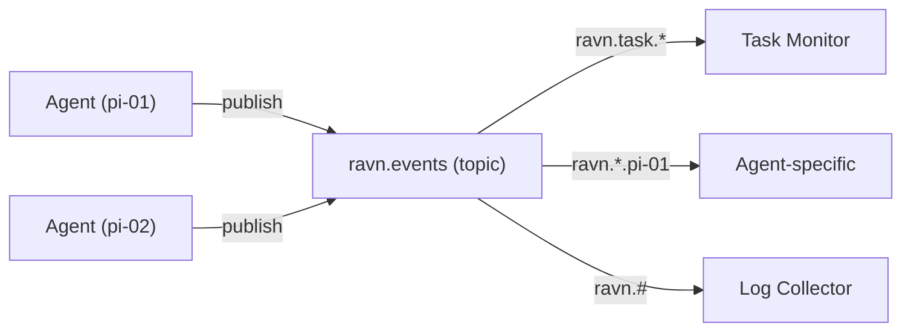

# Sleipnir Event Backbone

Sleipnir is Ravn's event publishing system built on RabbitMQ. It enables
agents to broadcast lifecycle events, task results, and system signals
to other services and agents.

## RabbitMQ Setup

Sleipnir uses a **topic exchange** for flexible event routing:

| Setting | Default | Description |
|---------|---------|-------------|
| Exchange | `ravn.events` | Topic exchange name. |
| Routing key format | `ravn.<event_type>.<agent_id>` | Dot-separated routing key. |
| Connection | `SLEIPNIR_AMQP_URL` env var | AMQP connection URL. |

## Exchange Topology



Consumers bind queues with routing key patterns:

- `ravn.task.*` — all task events from any agent
- `ravn.*.pi-01` — all events from a specific agent
- `ravn.#` — all events (wildcard)

## Event Types

Events are wrapped in a `SleipnirEnvelope` with metadata:

| Field | Description |
|-------|-------------|
| `event_type` | Event category (see below). |
| `agent_id` | Originating agent identifier. |
| `timestamp` | ISO 8601 timestamp. |
| `urgency` | Hint for consumers (e.g., `routine`, `urgent`). |
| `payload` | Event-specific data. |

Common event types:

| Event | Published When |
|-------|---------------|
| `task.started` | Agent begins a task. |
| `task.completed` | Task finishes (success or failure). |
| `task.rejected` | Task dispatch rejected (unknown persona, etc.). |
| `agent.heartbeat` | Periodic heartbeat from daemon. |
| `agent.started` | Agent process starts. |
| `agent.stopped` | Agent process stops. |
| `flock.peer_joined` | New peer discovered. |
| `flock.peer_left` | Peer evicted (TTL expired). |

## Consumer Patterns

### Direct Subscription

Listen for specific events:

```python
# Subscribe to task completion events
channel.queue_bind(queue_name, "ravn.events", routing_key="ravn.task.completed.*")
```

### Fan-out to Multiple Consumers

Each consumer binds its own queue — RabbitMQ delivers to all matching queues.

### Integration with Drive Loop

The initiative engine subscribes to Sleipnir events as trigger sources.
When a matching event arrives, it enqueues a task:

```yaml
initiative:
  trigger_adapters:
    - adapter: "ravn.adapters.triggers.sleipnir.SleipnirEventTrigger"
      event_type: "deployment.completed"
      prompt: "Verify deployment health"
```

## Connection Behavior

- **Lazy connection**: First publish triggers AMQP connect
- **Auto-reconnect**: Reconnects on failure with configurable delay
- **Publish timeout**: Per-message timeout prevents blocking

## Configuration

```yaml
sleipnir:
  enabled: true
  amqp_url_env: "SLEIPNIR_AMQP_URL"
  exchange: "ravn.events"
  agent_id: ""              # auto: hostname
  reconnect_delay_s: 5.0
  publish_timeout_s: 2.0
```

Related: [NIU-438](https://linear.app/niuulabs/issue/NIU-438)
