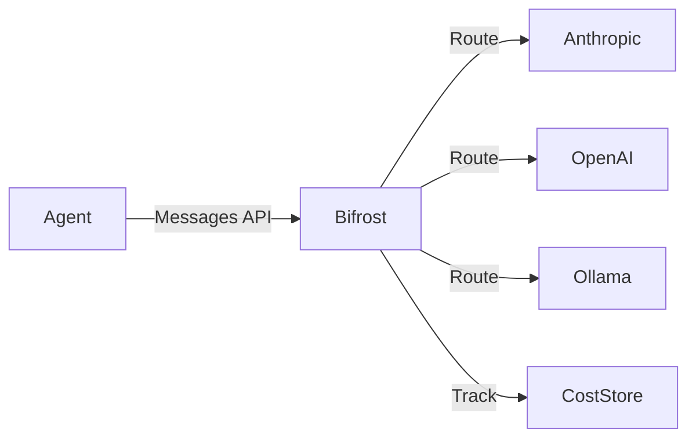

# Bifrost — LLM Proxy & Cost Management

Bifrost is Ravn's centralized LLM proxy layer. It sits between the agent and
all LLM providers, managing API keys, tracking costs, routing requests, and
enforcing budgets.

## Architecture



Agents never hold API keys directly. All LLM traffic flows through Bifrost,
which exposes an Anthropic Messages API-compatible endpoint. Bifrost is
identity-aware: it tracks usage per agent and session via HTTP headers.

## Model Aliases

Aliases decouple agent code from specific model versions. When a persona or
config references an alias, Bifrost resolves it to the current model mapping.

| Alias | Purpose | Example Resolution |
|-------|---------|-------------------|
| `powerful` | Most capable model for complex reasoning | `claude-opus-4` |
| `balanced` | Default production model for general tasks | `claude-sonnet-4-6` |
| `fast` | Cheap/quick model for reflection, summaries | `claude-haiku-4-5-20251001` |

Custom aliases are configurable:

```yaml
bifrost:
  aliases:
    powerful: claude-opus-4
    balanced: claude-sonnet-4-6
    fast: claude-haiku-4-5-20251001
    code: claude-sonnet-4-6  # custom alias
```

Personas reference aliases via `primary_alias`:

```yaml
# coding-agent persona
primary_alias: balanced
```

Reflection and outcome calls default to the `fast` alias.

## Routing Strategies

Bifrost supports five routing strategies that control how requests are
distributed across configured providers.

| Strategy | Behavior |
|----------|----------|
| `failover` (default) | Try primary provider, fall back on 429/5xx errors. |
| `cost_optimised` | Cheapest provider first. |
| `round_robin` | Cycle through providers evenly. |
| `latency_optimised` | Fastest provider first, based on EWMA P99 latency. |
| `direct` | Single provider, no failover. |

Per-model overrides are available via `model_routing_strategies`.

## Cost Tracking & Budgets

Bifrost records per-request token counts and estimated costs.

**Quota enforcement:**

| Quota | Description |
|-------|-------------|
| `max_tokens_per_day` | Daily token cap across all requests. |
| `max_cost_per_day` | Daily dollar cost cap. |
| `max_requests_per_hour` | Hourly request rate limit. |

**Soft limits:**

A configurable warning threshold (default: 80%) triggers alerts before
hard limits are hit. When near the limit, Bifrost can auto-route to a
cheaper model via `warn_target`:

```yaml
bifrost:
  guardrails:
    warn_threshold: 0.8
    warn_target: fast  # route to fast alias near limit
```

**Storage backends for usage data:**

- `memory` — in-process (lost on restart)
- `sqlite` — local persistence
- `postgres` — shared across instances
- `otel` — OpenTelemetry export

**Audit trail** adapters: `null`, `sqlite`, `postgres`, `otel` with
configurable detail levels.

## Integration with Ravn

The `BifrostAdapter` extends `AnthropicAdapter`, removing the API key and
injecting identity headers:

- `X-Ravn-Agent-Id` — identifies the calling agent
- `X-Ravn-Session-Id` — identifies the session

This integrates with Ravn's `FallbackAdapter` for additional layered failover:
Bifrost handles provider-level failover, while the fallback adapter handles
adapter-level failover.

## Configuration

```yaml
llm:
  provider:
    adapter: ravn.adapters.llm.bifrost.BifrostAdapter
    kwargs:
      base_url: "http://bifrost.ravn.svc:8080"

bifrost:
  providers:
    - name: anthropic
      api_key_env: ANTHROPIC_API_KEY
    - name: openai
      api_key_env: OPENAI_API_KEY
  aliases:
    powerful: claude-opus-4
    balanced: claude-sonnet-4-6
    fast: claude-haiku-4-5-20251001
  routing_strategy: failover
  auth_mode: header
  default_quota:
    max_tokens_per_day: 1000000
    max_cost_per_day: 50.0
    max_requests_per_hour: 100
  guardrails:
    warn_threshold: 0.8
    warn_target: fast
  usage_store: sqlite
  audit: sqlite
```

### Config Keys

| Key | Description |
|-----|-------------|
| `bifrost.providers` | List of LLM provider backends. |
| `bifrost.aliases` | Model alias → model ID mappings. |
| `bifrost.routing_strategy` | Default routing strategy. |
| `bifrost.auth_mode` | How agents authenticate to Bifrost. |
| `bifrost.default_quota` | Default per-agent quotas. |
| `bifrost.guardrails` | Budget guardrail configuration. |
| `bifrost.usage_store` | Token/cost storage backend. |
| `bifrost.audit` | Audit trail backend and detail level. |
