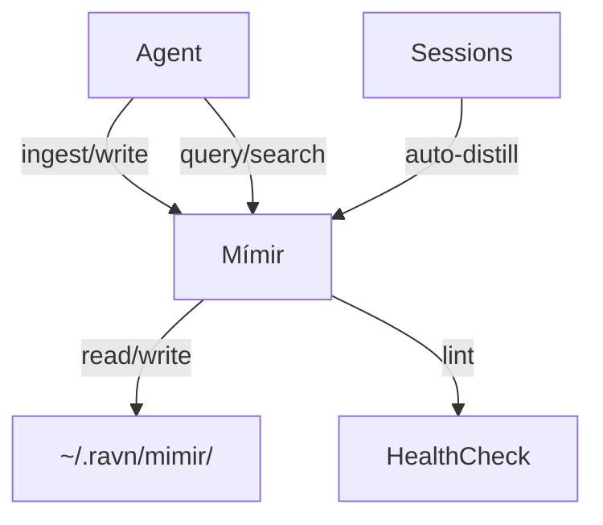

# Mímir — Persistent Knowledge Base

Mímir is a markdown-backed wiki system where Ravn ingests, synthesizes, searches,
and maintains persistent knowledge across sessions. Unlike episodic memory (raw
recall), Mímir is curated knowledge — wiki articles that compound over time.

## Architecture



Mímir can run as:

- **Local adapter** — filesystem-backed, for single-agent use
- **HTTP service** — standalone FastAPI, for shared deployments
- **Composite** — multiple instances with routing rules

## Wiki Structure

```
~/.ravn/mimir/
├── wiki/
│   ├── index.md              # Auto-updated content catalog
│   ├── log.md                # Append-only operation log
│   ├── technical/            # Infrastructure, codebase docs
│   │   ├── volundr/
│   │   └── ravn/
│   ├── projects/             # Project documentation
│   ├── research/             # Topic deep-dives
│   ├── household/            # Personal/home knowledge
│   └── self/                 # Agent patterns, preferences
├── raw/
│   └── <source_id>.json      # Immutable source metadata + content
└── MIMIR.md                  # Schema/conventions seed
```

## Agent Tools

Mímir provides six tools for agent interaction:

| Tool | Permission | Description |
|------|-----------|-------------|
| `mimir_ingest` | `mimir:write` | Ingest URL or raw text as immutable source. Records content hash for staleness detection. Optionally derives wiki pages via synthesis. |
| `mimir_query` | `mimir:read` | Natural language question → relevant pages. For knowledge synthesis and answering questions from the wiki. |
| `mimir_read` | `mimir:read` | Read full content of a wiki page by path. |
| `mimir_write` | `mimir:write` | Create or update a wiki page. Pages are Markdown with a `# Title` header. |
| `mimir_search` | `mimir:read` | Full-text keyword search. Returns matching page paths ranked by hit count. |
| `mimir_lint` | `mimir:read` | Health check across the wiki. |

## Auto-Distill

After qualifying sessions (duration ≥ `distill_min_session_minutes`), Mímir
automatically extracts learnings and writes them as wiki pages. This bridges
ephemeral session context into persistent knowledge.

Control via config:

```yaml
mimir:
  auto_distill: true
  distill_min_session_minutes: 5
```

## Lint System

The lint tool checks wiki health across four dimensions:

| Check | Description |
|-------|-------------|
| **Orphans** | Pages not linked from `index.md`. |
| **Contradictions** | Pages with `<!-- contradiction -->` markers. |
| **Stale** | Pages whose source content hash changed since ingest. |
| **Gaps** | Concepts frequently mentioned but lacking dedicated pages. |

Auto-lint fires after `idle_lint_threshold_minutes` of drive-loop inactivity
(default: 60 minutes).

## Search Backend

Currently full-text search (FTS) — keyword-based substring matching ranked by
hit count. Fast with no ML overhead.

Future: vector search extension point (embeddings + cosine similarity) via the
`mimir.search.backend` config.

## Multi-Instance Deployment

The composite adapter mounts multiple Mímir instances with routing rules:

```yaml
mimir:
  instances:
    - name: local
      role: local
      path: "~/.ravn/mimir"
      categories: [self, household]
    - name: shared
      role: shared
      url: "http://mimir.ravn.svc:8080"
      auth:
        type: bearer
        token: "${MIMIR_TOKEN}"
      categories: [technical, projects]
    - name: domain
      role: domain
      url: "http://mimir-domain.ravn.svc:8080"
      categories: [research]
```

**Read precedence:** lower priority first (local=0, shared=1, domain=2).
Results merge across instances with de-duplication by path.

**Write routing:** prefix rules control which instances receive writes:

```yaml
mimir:
  write_routing:
    rules:
      - prefix: "self/"
        mounts: [local]
      - prefix: "technical/"
        mounts: [local, shared]
      - prefix: "research/"
        mounts: [shared, domain]
```

## How Mímir Differs from Búri

| Aspect | Mímir | Búri |
|--------|-------|------|
| Purpose | Curated wiki (synthesis) | Typed fact graph (assertions) |
| Format | Markdown articles | Structured facts with confidence |
| Updates | Explicit write/ingest | Auto-extracted from sessions |
| Search | Full-text keyword | Typed recall + vMF clustering |
| Organization | Category directories | Fact types + temporal versioning |

Mímir is what the agent *writes down and maintains*. Búri is what the agent
*remembers and believes*. They complement each other: Búri captures raw
assertions, Mímir synthesizes them into coherent documents.

## Configuration

```yaml
mimir:
  enabled: true
  path: "~/.ravn/mimir"
  auto_distill: true
  distill_min_session_minutes: 5
  idle_lint_threshold_minutes: 60
  continuation_threshold_minutes: 30
  categories:
    - technical
    - projects
    - research
    - household
    - self
  search:
    backend: fts
```

See the [Configuration Reference](../configuration/reference.md#mimir) for all fields.
