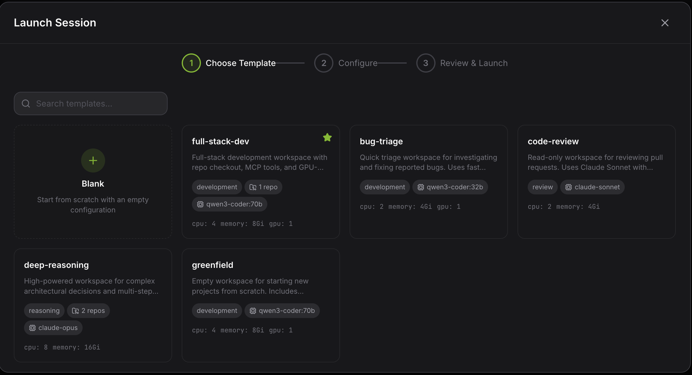
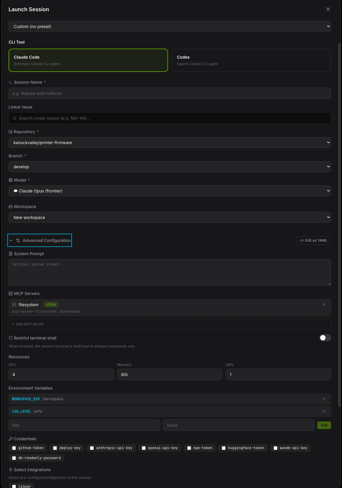
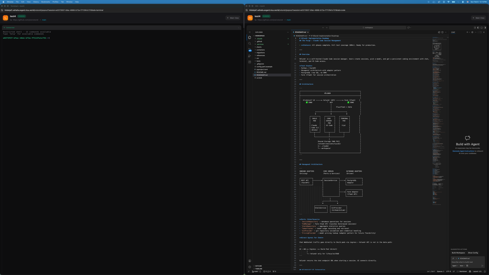
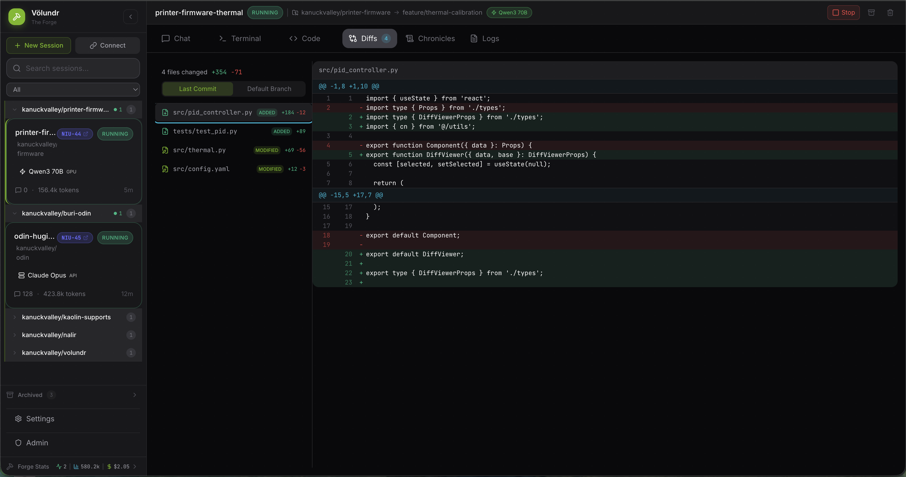
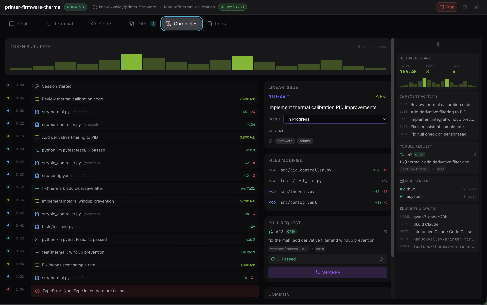
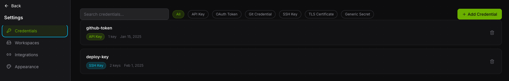
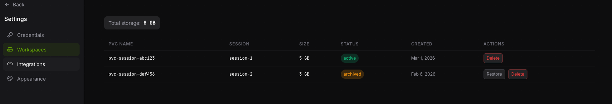
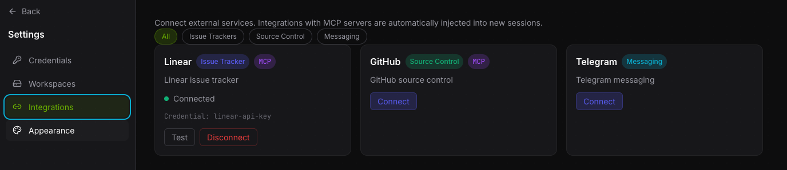
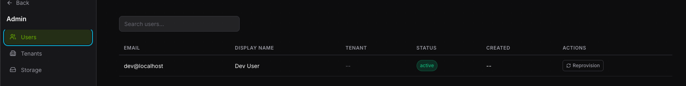
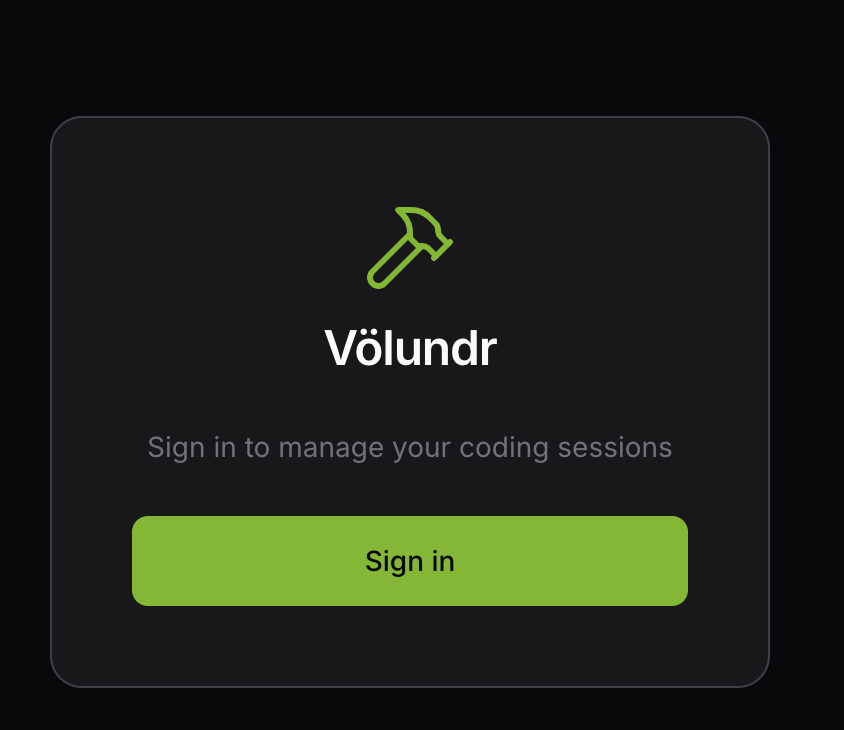

# Web UI

The Volundr web UI is a React single-page application built with Vite. It covers session management, settings, and admin functions.

## Session management

### Dashboard

The dashboard shows all your sessions with status, model, repo, and tokens used.

### Launch wizard

Sessions are created through a two-step wizard:

1. **Pick a template** — browse available workspace templates.
2. **Configure** — set the session name, model, repo, branch, credentials, integrations, and MCP servers.

<figure markdown>

<figcaption>Step 1 — choose a template</figcaption>
</figure>

<figure markdown>

<figcaption>Step 2 — configure the session</figcaption>
</figure>

### Session workspace

Once a session is running, open it to access the workspace tabs:

- **Chat** — talk to the AI coding agent in real-time via WebSocket.
- **Terminal** — full shell access powered by ttyd.
- **Code** — VS Code running in the browser via code-server.
- **Diffs** — review file changes with an inline diff viewer.
- **Chronicles** — browse session history and timelines.

<figure markdown>

<figcaption>Session workspace with tabs</figcaption>
</figure>

<figure markdown>

<figcaption>Diffs — review code changes</figcaption>
</figure>

## Settings

- **Credentials** — manage API keys, OAuth tokens, and SSH keys.
- **Integrations** — configure connections to external services like Linear and Jira.
- **Workspaces** — manage PVC storage for persistent session data.

<figure markdown>

<figcaption>Workspace PVC management</figcaption>
</figure>

<figure markdown>

<figcaption>External service integrations</figcaption>
</figure>

## Admin

Admin pages are visible only to users with the admin role.

- **User management** — view and manage users across tenants.
- **Tenant management** — create and configure tenants.

## Authentication

The web UI uses OIDC for authentication. Any compliant identity provider works — Keycloak, Entra ID, Okta, or anything else that speaks OIDC. Auth configuration is set in the Helm values.

